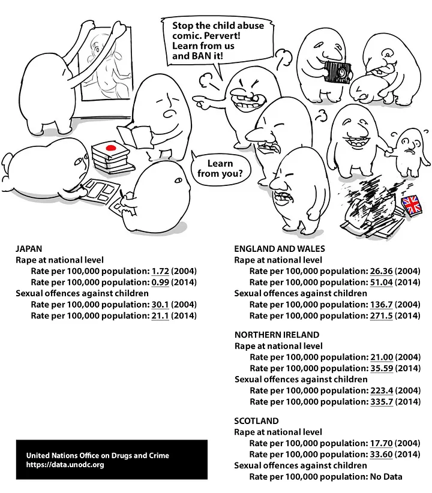

藝人黃子佼遭爆出涉性侵未成年與持有未成年不雅影片，檢警從黃子佼住處查扣的證物中發現藏有大量未成年女子裸露胸部、陰部從事自慰或性交的影片，而影片來源正是曾被起訴過的全台最大情色論壇「創意私房」。

國外這種事也屢見不鮮，比如netflix類似紀錄片「網路煉獄-揭發N號房」、「全網最痛恨的男人」之類。這些受害者都要過著痛苦的一生，卻鮮少人為這些人加油。反之黃子佼在臉書寫下道歉文，雖然留言區還出現一堆回應「加油」的留言。

## 社會的規範，往往是找容易欺負的人開刀，只許州官放火，不許百姓點燈。

對上最近的網路內容防護機構iWIN用「讓人覺得」作為判斷標準，無端禁制各種平台上的文章。長年關心兒少議題的刑法學者、民進黨新任立委沈伯洋也在臉書指出，iWIN用「引起性聯想」來判定不是一個很好的作法。沈伯洋舉例：「有人看到馬桶都有性聯想該怎麼辦？如果覺得太極端，改成「廣泛引起性聯想」，那要廣泛到幾趴？」

而這麼「關注」兒童福利的單位，黃子佼卻是大使。

在台灣這種事情屢見不鮮，吸毒的人擔任反毒大使、犯罪者擔任司法改革委員、立委酒駕來審核酒駕法律、性侵未成年的人擔任兒福聯盟大使、……。

不只是台灣如此，國際也是如此。2019年聯合國也發布禁止人物身材與臉過於年輕，很顯然也是指針對日本。

但日本是兒童犯罪率遠低於歐美區域的國家，聯合國卻不先從管制歐美下手。

